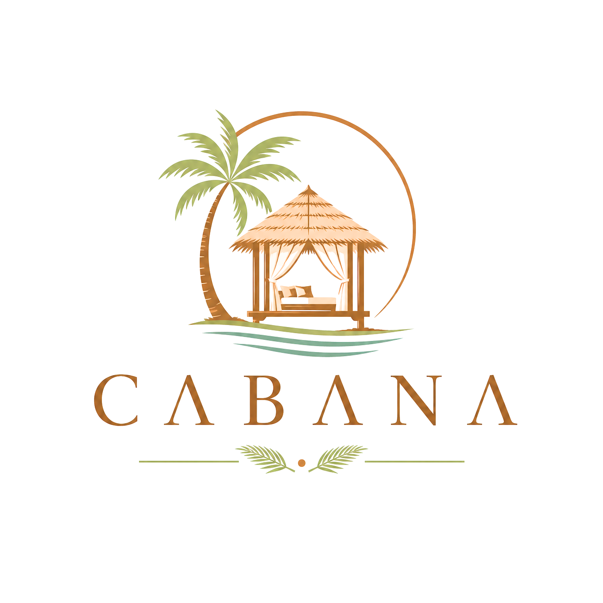
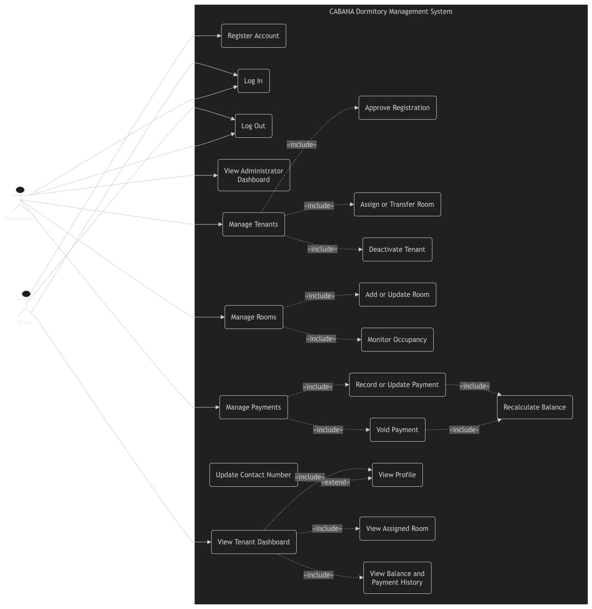
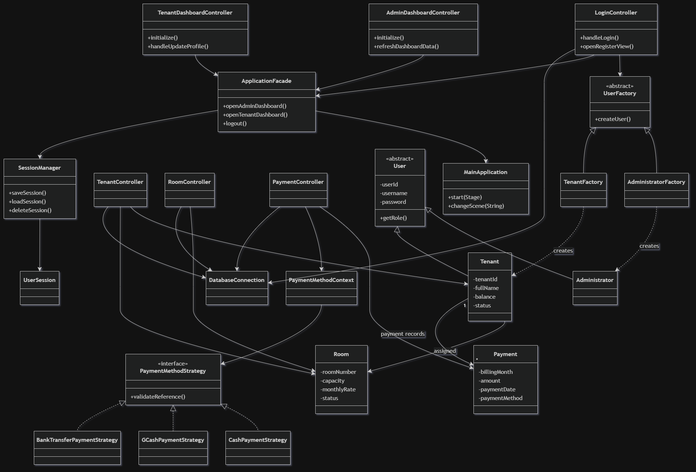
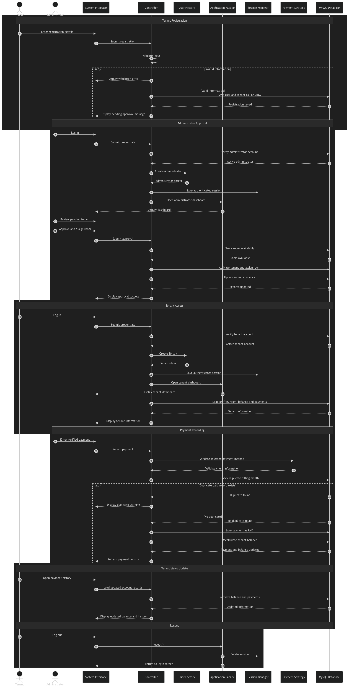
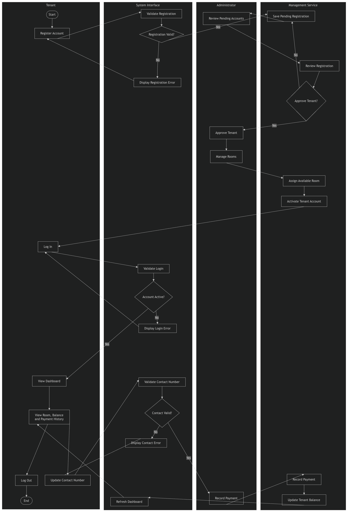

<p align="center">
  
</p>

<div align="center">

# 🏠 Cabana Dormitory Management System

### *A JavaFX-based Dormitory Management System for Efficient Tenant, Room, and Payment Administration*


</div>

---

# 📚 Table of Contents

- [📌 About the Project](#-about-the-project)
- [✨ Key Features](#-key-features)
- [🛠️ Technologies Used](#️-technologies-used)
- [🏛️ System Architecture](#️-system-architecture)
- [📐 UML Diagrams](#-uml-diagrams)
- [💾 Java Serialization](#-java-serialization)
- [🧵 Java Multithreading](#-java-multithreading)
- [🧱 SOLID Principles Applied](#-solid-principles-applied)
- [🎨 Design Patterns](#-design-patterns)
- [🗄️ Database Design](#️-database-design)
- [📁 Project Structure](#-project-structure)
- [🚀 Installation](#-installation)
- [🔮 Future Improvements](#-future-improvements)
- [👤 Author](#-author)
- [📄 License](#-license)

---

<div align="center">

# 📌 About the Project

</div>

<div align="justify">

The **Cabana Dormitory Management System** is a desktop-based dormitory management application developed using **JavaFX**, **JDBC**, and **MySQL** following the **Model–View–Controller (MVC)** architectural pattern. It was created as the capstone project for **Object-Oriented Programming 2**, demonstrating the practical application of object-oriented design principles, database integration, graphical user interface development, session persistence, and software design patterns.

The system centralizes the daily administrative operations of a dormitory by providing role-based access for **Administrators** and **Tenants**. It enables administrators to efficiently manage tenant registrations, room assignments, occupancy monitoring, payment records, and dashboard summaries, while tenants are provided with a secure personal dashboard where they can monitor their assigned room, outstanding balance, payment history, and profile information.

To improve software maintainability and extensibility, the project applies **Factory Method**, **Facade**, and **Strategy** design patterns alongside **SOLID principles**. User sessions are preserved using **Java Serialization**, allowing authenticated users to continue their session after restarting the application until they explicitly log out.

Rather than simply demonstrating CRUD operations, the project models a realistic dormitory management workflow where tenant registrations undergo administrative approval, room occupancy is automatically maintained, payment records update tenant balances, and user access is controlled according to account status and assigned roles.

---

### 🌍 Real-World Workflow

The Cabana Dormitory Management System reflects the daily operations of a typical boarding house or dormitory where the **Administrator** serves as the central authority for managing tenants, rooms, and financial records. Prospective tenants begin by submitting a registration request, which remains in a **Pending** state until reviewed by the administrator. Once approved, the administrator assigns an available room based on its capacity and operational status, ensuring that maintenance, inactive, or fully occupied rooms cannot be assigned.

After activation, tenants gain secure access to their personal dashboard where they can view their assigned room, current account balance, payment history, and profile information while being limited to updating only their own contact details. Monthly rental payments are received through the dormitory's existing payment channels, such as **cash**, **GCash**, or **bank transfer**, and are officially recorded, updated, or voided only by the administrator after payment verification. Every room assignment automatically updates room occupancy, every recorded payment recalculates tenant balances, and authenticated sessions are securely restored through **Java Serialization** until the user explicitly logs out. Through this workflow, the system provides a centralized, accurate, and role-based solution for managing day-to-day dormitory operations.

</div>

---

<div align="center">

# ✨ Key Features

</div>

| Module | Description |
|:-------|:------------|
| 🔐 Authentication | Secure role-based login for Administrators and Tenants |
| 👤 Tenant Registration | Pending registration workflow requiring administrator approval |
| 🏠 Room Management | Room creation, updating, occupancy monitoring, and activation management |
| 👥 Tenant Management | Tenant approval, room assignment, updates, transfers, and deactivation |
| 💳 Payment Management | Record, update, search, and void payment transactions |
| 📊 Administrator Dashboard | Displays occupancy statistics, tenant summaries, revenue, balances, and recent activities |
| 🏡 Tenant Dashboard | Displays profile, assigned room, payment history, and outstanding balance |
| 💾 Session Persistence | Automatic login restoration through Java Serialization |
| ✔ Input Validation | Validation of user inputs using reusable validation classes and custom exceptions |
| 🎨 Modern JavaFX UI | Responsive desktop interface with consistent styling and navigation |
| 🧱 MVC Architecture | Separation of presentation, business logic, and data access layers |
| 🏛 Design Patterns | Factory Method, Facade, and Strategy patterns for improved maintainability |

---

<div align="center">

# 🛠️ Technologies Used

</div>

| Category | Technology                        |
|:---------|:----------------------------------|
| Programming Language | Java                              |
| GUI Framework | JavaFX                            |
| Database | MySQL                             |
| Database Connectivity | JDBC                              |
| Build Tool | Maven                             |
| IDE | IntelliJ IDEA                     |
| Architecture | Model–View–Controller (MVC)       |
| Session Persistence | Java Serialization                |
| Version Control | Git & GitHub                      |
| UML Modeling | PlantUML / Mermaid / diagrams.net |

---

<div align="center">

### 📦 Core Java Concepts Demonstrated

</div>

- Object-Oriented Programming (OOP)
- Encapsulation
- Inheritance
- Polymorphism
- Abstraction
- Interfaces
- Abstract Classes
- Exception Handling
- Collections Framework
- JavaFX Event Handling
- JDBC Database Programming
- Java Serialization
- Generic Programming
- Design Patterns
- SOLID Principles

---

<div align="center">

# 🏛️ System Architecture

</div>

<div align="justify">

The **Cabana Dormitory Management System** follows the **Model–View–Controller (MVC)** architectural pattern to separate the presentation layer, business logic, and data access layer. This separation improves maintainability, scalability, readability, and testability by ensuring that each component has a well-defined responsibility.

The presentation layer consists of JavaFX FXML views and CSS styling responsible for user interaction. Controllers process user requests and coordinate application behavior, while the model layer represents the application's core business entities. Persistent data is managed through MySQL using JDBC, whereas authenticated sessions are maintained locally using Java Serialization.

The application also incorporates multiple software design patterns to reduce coupling and improve extensibility without affecting existing functionality.

</div>

---

<div align="center">

```text
                           USER
                             │
                             ▼
                  JavaFX User Interface
                 (FXML Views + CSS Files)
                             │
                             ▼
                  JavaFX Controllers
──────────────────────────────────────────────────
 LoginController
 RegisterController
 AdminDashboardController
 TenantDashboardController
 TenantController
 RoomController
 PaymentController
──────────────────────────────────────────────────
                             │
                             ▼
                 Business Logic Layer
──────────────────────────────────────────────────
 Factory Method
 Facade
 Strategy
 Validation
 Authentication
 Session Management
 Business Rules
──────────────────────────────────────────────────
                             │
                             ▼
                 Persistence Layer
──────────────────────────────────────────────────
 JDBC
 Java Serialization
 DatabaseConnection
──────────────────────────────────────────────────
                             │
                             ▼
                      MySQL Database
──────────────────────────────────────────────────
 users
 tenants
 rooms
 payments
──────────────────────────────────────────────────
```

</div>

---

<div align="center">

### ✔ Architectural Advantages

</div>

- Separation of Concerns
- Modular Application Structure
- Improved Maintainability
- Reusable Components
- Low Coupling and High Cohesion
- Easier Future Expansion
- Clear Layered Architecture

---

<div align="center">

# 📐 UML Diagrams

</div>

<div align="justify">

The following UML diagrams document both the **structural** and **behavioral** aspects of the Cabana Dormitory Management System. Together, they illustrate how the implemented source code aligns with the business requirements, software architecture, object-oriented design principles, and applied design patterns.

Each diagram complements the others by representing the same system from different perspectives.

</div>

---

## 📌 1. Use Case Diagram

<p align="center">
    
</p>

<div align="justify">

Presents the overall functional requirements of the CABANA Dormitory Management System by illustrating the interactions between the two primary actors—**Administrator** and **Tenant**. It summarizes the system's major capabilities, including account registration, authentication, tenant management, room assignment, payment management, and tenant self-service features.

</div>

---

## 🏛️ 2. Class Diagram

<p align="center">
    
</p>

<div align="justify">

Illustrates the system's object-oriented architecture by showing the relationships among the core model classes, controllers, database and session components, and the implemented **Factory Method**, **Facade**, and **Strategy** design patterns. The diagram demonstrates how responsibilities are organized following the Model–View–Controller (MVC) architecture and SOLID principles.

</div>

---

## 🔄 3. Sequence Diagram

<p align="center">
    
</p>

<div align="justify">

Describes the complete interaction flow of the system, beginning with tenant registration, administrator approval, room assignment, user authentication, tenant dashboard access, payment recording, automatic balance updates, and user logout. The diagram highlights how the application's components collaborate throughout the entire dormitory management process.

</div>

---

## 📊 4. Activity Diagram

<p align="center">
    
</p>

<div align="justify">

Illustrates the overall workflow of the CABANA Dormitory Management System using four swimlanes representing the **Tenant**, **System Interface**, **Management Service**, and **Administrator**. It depicts the complete business process from registration and approval, room assignment, login, tenant self-service, payment recording, balance updating, and logout, providing a high-level view of the system's operational flow.

</div>

---

<div align="center">

# 💾 Java Serialization

</div>

<div align="justify">

The Cabana Dormitory Management System implements **Java Object Serialization** to preserve authenticated user sessions between application launches. Once a user successfully logs in, the application serializes a lightweight session object that stores only the information necessary to restore the previous authenticated state.

When the application starts, the serialized session is validated before automatically restoring the appropriate dashboard. Sessions remain active until the user explicitly logs out, at which point the serialized session file is securely removed.

</div>

---

### Session Components

| Class | Responsibility |
|:------|:---------------|
| `UserSession` | Stores authenticated user information |
| `SessionStorage` | Defines the session storage abstraction |
| `FileSessionStorage` | Reads and writes serialized session files |
| `SessionManager` | Controls session creation, loading, validation, and deletion |

---


### Serialization Workflow

```text
Successful Login
        │
        ▼
SessionManager.saveSession()
        │
        ▼
session.txt Created
        │
        ▼
Application Closed
        │
        ▼
Application Reopened
        │
        ▼
SessionManager.loadSession()
        │
        ▼
Valid Session?
    │           │
   Yes         No
    │           │
    ▼           ▼
Dashboard   Login Screen
    │
    ▼
Logout
    │
    ▼
SessionManager.deleteSession()
    │
    ▼
session.txt Deleted
```

---

### Serialized Information

- User ID
- Tenant ID *(if applicable)*
- Username
- Full Name
- User Role
- Account Status

> **Passwords are never serialized or stored inside the session file.**

---

### Benefits

- Persistent authenticated sessions
- Automatic login restoration
- Faster application startup
- Secure role validation
- Improved user experience
- Simplified desktop authentication

---

---

<div align="center">

# 🧵 Java Multithreading

</div>

<div align="justify">

To improve application responsiveness, the Cabana Dormitory Management System utilizes **JavaFX's Task API** to perform periodic dashboard refresh operations on a **background daemon thread**. Rather than executing scheduled refreshes directly on the JavaFX Application Thread, a background task is created every refresh cycle to handle the operation asynchronously.

After the background task begins execution, user interface updates are safely delegated back to the JavaFX Application Thread using `Platform.runLater()`. This approach prevents the scheduled refresh mechanism from blocking the application's user interface while maintaining thread safety during dashboard updates.

The implementation demonstrates the practical use of Java concurrency within a JavaFX desktop application while preserving the existing business logic and application workflow.

</div>

---

### Components

| Component | Responsibility |
|:----------|:---------------|
| `Task<Void>` | Executes dashboard refresh asynchronously |
| `Thread` | Runs the background task |
| `Platform.runLater()` | Safely updates the JavaFX user interface |
| `Timeline` | Schedules automatic dashboard refresh every 30 seconds |

---

### Workflow

```text
Timeline (30 seconds)
        │
        ▼
Create JavaFX Task
        │
        ▼
Start Background Thread
        │
        ▼
Platform.runLater()
        │
        ▼
refreshDashboardData()
        │
        ▼
Dashboard Updated
```

---

### Benefits

- Non-blocking dashboard refresh
- Improved UI responsiveness
- Safe JavaFX thread synchronization
- Demonstrates Java concurrency concepts
- Minimal impact on existing application architecture

---

<div align="center">

# 🧱 SOLID Principles Applied

</div>

<div align="justify">

The project follows selected **SOLID principles** to improve maintainability, flexibility, readability, and extensibility. By assigning clear responsibilities to individual classes and depending on abstractions rather than concrete implementations, the application becomes easier to modify without introducing unnecessary side effects.

</div>

---

## 1️⃣ Single Responsibility Principle (SRP)

Every class has **one primary responsibility**.

| Class | Responsibility |
|:------|:---------------|
| `DatabaseConnection` | Establishes MySQL database connections |
| `SessionManager` | Controls the lifecycle of user sessions |
| `FileSessionStorage` | Handles Java Serialization only |
| `UserSession` | Stores authenticated session data |
| Controllers | Handle JavaFX user interactions |
| Models | Represent business entities |

### Benefits

- Easier debugging
- Better maintainability
- Higher readability
- Improved modularity

---

## 2️⃣ Dependency Inversion Principle (DIP)

Instead of depending directly on file serialization, `SessionManager` communicates through the `SessionStorage` abstraction.

```text
SessionManager
      │
      ▼
SessionStorage (Interface)
      │
      ▼
FileSessionStorage
```

### Benefits

- Loose coupling
- Easier future storage implementations
- Better extensibility
- Improved scalability

---

<div align="center">

# 🎨 Design Patterns

</div>

<div align="justify">

To improve software quality and maintainability, the Cabana Dormitory Management System applies three **Gang of Four (GoF)** design patterns. Each pattern addresses a different architectural concern while promoting modularity, flexibility, and reduced coupling among application components.

</div>

---

## 🏗️ Factory Method (Creational)

| Classes |
|:---------|
| `UserFactory` |
| `AdministratorFactory` |
| `TenantFactory` |

**Purpose**

Creates `Administrator` and `Tenant` objects through specialized factories instead of directly instantiating concrete classes inside `LoginController`. This centralizes object creation and simplifies future expansion for additional user roles.

---

## 🏛️ Facade (Structural)

| Class |
|:------|
| `ApplicationFacade` |

**Purpose**

Provides a simplified interface for scene navigation and session operations by encapsulating interactions with `MainApplication`, `SessionManager`, and `UserSession`. Controllers interact with a single facade rather than multiple subsystem classes.

---

## ⚙️ Strategy (Behavioral)

| Classes |
|:---------|
| `PaymentMethodContext` |
| `PaymentMethodStrategy` |
| `CashPaymentStrategy` |
| `GCashPaymentStrategy` |
| `BankTransferPaymentStrategy` |

**Purpose**

Encapsulates payment-method-specific validation rules. Each payment method defines its own validation behavior, allowing the `PaymentController` to delegate payment processing dynamically without relying on large conditional statements.

---

### Benefits of the Applied Design Patterns

- Reduced coupling between components
- Improved code maintainability
- Greater extensibility
- Better adherence to object-oriented principles
- Easier testing and future feature expansion

---

<div align="center">

# 🗄️ Database Design

</div>

<div align="justify">

The Cabana Dormitory Management System utilizes a **relational MySQL database** to maintain data integrity and efficiently manage relationships between users, tenants, rooms, and payment records. Through **JDBC**, the application performs secure CRUD operations while enforcing business rules such as tenant approval, room occupancy validation, and automatic balance recalculation.

The database design minimizes redundancy by separating authentication information from tenant-specific records while maintaining referential integrity using foreign keys.

</div>

---

## 📋 Database Tables

| Table | Purpose |
|:------|:--------|
| **users** | Stores login credentials, user roles, and account status |
| **tenants** | Stores tenant personal information, assigned room, balance, and contact details |
| **rooms** | Stores room information, capacity, occupancy, monthly rate, and operational status |
| **payments** | Stores payment transactions, billing months, payment methods, and payment status |

---

### Entity Relationships

```text
Users (1)
    │
    │
    ▼
Tenants (1)
    │
    ├──────────────► Rooms
    │                  ▲
    │                  │
    │                  │
    ▼                  │
Payments (*)───────────┘
```

---

### Business Rules

- Only **approved tenants** may access the system.
- A room cannot exceed its maximum capacity.
- Inactive or maintenance rooms cannot receive new tenants.
- Duplicate paid billing months are not allowed.
- Every successful payment automatically recalculates the tenant's balance.
- Deactivating a tenant automatically releases the occupied room.
- Only administrators may create, modify, or void payment records.

---

<div align="center">

# 📁 Project Structure

</div>

```text
Cabana-Dormitory-Management-System
│
├── src
│   ├── main
│   │
│   ├── java
│   │   └── com.example.cabiso_capstone
│   │
│   │       ├── controllers
│   │       │     ├── LoginController
│   │       │     ├── RegisterController
│   │       │     ├── AdminDashboardController
│   │       │     ├── TenantDashboardController
│   │       │     ├── TenantController
│   │       │     ├── RoomController
│   │       │     └── PaymentController
│   │       │
│   │       ├── model
│   │       │     ├── User
│   │       │     ├── Administrator
│   │       │     ├── Tenant
│   │       │     ├── Room
│   │       │     └── Payment
│   │       │
│   │       ├── database
│   │       │     └── DatabaseConnection
│   │       │
│   │       ├── session
│   │       │     ├── SessionManager
│   │       │     ├── SessionStorage
│   │       │     ├── FileSessionStorage
│   │       │     └── UserSession
│   │       │
│   │       ├── validation
│   │       │     └── InputValidator
│   │       │
│   │       ├── exceptions
│   │       │     ├── ValidationException
│   │       │     └── InvalidContactNumberException
│   │       │
│   │       ├── factory
│   │       │     ├── UserFactory
│   │       │     ├── AdministratorFactory
│   │       │     └── TenantFactory
│   │       │
│   │       ├── facade
│   │       │     └── ApplicationFacade
│   │       │
│   │       ├── strategy
│   │       │     ├── PaymentMethodContext
│   │       │     ├── PaymentMethodStrategy
│   │       │     ├── CashPaymentStrategy
│   │       │     ├── GCashPaymentStrategy
│   │       │     └── BankTransferPaymentStrategy
│   │       │
│   │       └── MainApplication
│   │
│   └── resources
│       └── com.example.cabiso_capstone
│
│           ├── fxml
│           │     ├── login-view.fxml
│           │     ├── register-view.fxml
│           │     ├── admin-dashboard-view.fxml
│           │     ├── tenant-dashboard-view.fxml
│           │     ├── tenant-view.fxml
│           │     ├── room-view.fxml
│           │     └── payment-view.fxml
│           │
│           ├── styles
│           │     └── styles.css
│           │
│           ├── images
│           │     └── CABANA.png
│           │
│           └── uml
│                 ├── Use-CaseDiagram.drawio.png
│                 ├── CoreClassDiagram.drawio.png
│                 ├── LoginAndSessionSequenceDiagram.drawio.png
│                 └── PaymentRecordSequenceDiagram.drawio.png
│
├── pom.xml
├── README.md
└── LICENSE
```

---

<div align="center">

# 🚀 Installation

</div>

## Prerequisites

Before running the application, ensure that the following software is installed:

- Java Development Kit (JDK 21 or later)
- Apache Maven
- MySQL Server
- IntelliJ IDEA (recommended)

---

## 1️⃣ Clone the Repository

```bash
git clone https://github.com/coding-chez/Cabana-Dormitory-Management-System.git
```

---

## 2️⃣ Open the Project

Open the project using **IntelliJ IDEA** and allow Maven to download all required dependencies.

---

## 3️⃣ Configure the Database

Create a MySQL database.

Example:

```sql
CREATE DATABASE cabana_db;
```

Import the provided SQL schema and configure the database credentials inside:

```text
DatabaseConnection.java
```

Update:

```java
private static final String URL = "...";
private static final String USER = "...";
private static final String PASSWORD = "...";
```

---

## 4️⃣ Run the Application

Run:

```text
MainApplication.java
```

The application will automatically display the Login screen.

---

<div align="center">

### Default Workflow

</div>

```text
Register Tenant
        │
        ▼
Administrator Approval
        │
        ▼
Room Assignment
        │
        ▼
Tenant Login
        │
        ▼
Tenant Dashboard
        │
        ▼
Administrator Records Payment
        │
        ▼
Balance Automatically Updates
```

---

<div align="center">

# 🔮 Future Improvements

</div>

<div align="justify">

Although the current implementation successfully fulfills the project's objectives, several enhancements could further improve usability, scalability, and real-world applicability.

Future versions of the system may include online payment integration, automated billing generation, email or SMS notifications, room reservation requests, tenant document uploads, maintenance request management, audit logging, reporting dashboards, cloud-based deployment, and multi-administrator support.

Additional security improvements such as password hashing, role-based authorization middleware, encrypted session storage, and database backup automation may also be incorporated to strengthen the application's reliability and security.

These enhancements would transform the project from an academic desktop application into a more comprehensive dormitory management solution suitable for real-world deployment.

---

### Possible Future Features

- Online payment integration
- QR-code payment verification
- Automated monthly billing
- Email and SMS notifications
- Maintenance request management
- Room reservation requests
- Audit logs
- Dashboard analytics
- Password hashing
- Cloud database support
- Multi-administrator accounts
- Backup and restore functionality
- Mobile companion application

---

<div align="center">

# 👤 Author


## Chestine May Mari C. Cabiso

**Bachelor of Science in Information Technology**

**College of Computer Studies**

**Cebu Institute of Technology – University**

Object-Oriented Programming 2 Capstone Project • 2026

---

<div align="center">

# 🎯 Project Objectives

</div>

<div align="justify">

This project was developed not only to satisfy the requirements of **Object-Oriented Programming 2**, but also to demonstrate the practical application of software engineering concepts learned throughout the course. The system integrates JavaFX desktop development, relational database management, object-oriented analysis and design, Java Serialization, and software design patterns into a single cohesive application.

Through the completion of this project, the following objectives were achieved:

- Design and implement a complete JavaFX desktop application.
- Apply the **Model–View–Controller (MVC)** architectural pattern.
- Integrate a relational MySQL database using **JDBC**.
- Preserve authenticated user sessions using **Java Serialization**.
- Apply the **SOLID Principles** to improve maintainability.
- Implement three **Gang of Four (GoF) Design Patterns**:
    - Factory Method (Creational)
    - Facade (Structural)
    - Strategy (Behavioral)
- Produce complete UML documentation consistent with the implemented source code.
- Simulate realistic dormitory management operations through role-based workflows.

</div>

---

<div align="center">

# 📊 Project Summary

</div>

| Category | Implementation |
|:---------|:---------------|
| Programming Language | Java 21 |
| GUI Framework | JavaFX |
| Database | MySQL |
| Database Connectivity | JDBC |
| Build Tool | Maven |
| Architecture | MVC |
| Session Persistence | Java Serialization |
| Design Patterns | Factory Method, Facade, Strategy |
| SOLID Principles | ✔ Implemented |
| UML Documentation | ✔ Complete |
| CRUD Operations | ✔ Complete |
| Authentication | ✔ Role-Based |
| Administrator Dashboard | ✔ Complete |
| Tenant Dashboard | ✔ Complete |
| Room Management | ✔ Complete |
| Tenant Management | ✔ Complete |
| Payment Management | ✔ Complete |

---

<div align="center">

# 🏆 Learning Outcomes

</div>

<div align="justify">

Developing the **Cabana Dormitory Management System** strengthened practical experience in designing, implementing, documenting, and maintaining a complete object-oriented desktop application. Beyond implementing CRUD operations, the project emphasized software architecture, code organization, maintainability, and the application of industry-recognized software engineering practices.

The project also reinforced the importance of separating responsibilities through MVC, improving extensibility using design patterns, maintaining user sessions securely through Java Serialization, and documenting software using UML diagrams that accurately reflect the implemented system.

Collectively, these concepts establish a solid foundation for developing larger desktop, web, and enterprise applications in future academic and professional software projects.

</div>

---

<div align="center">

# 📄 License

</div>

<div align="justify">

This repository was developed as an **academic capstone project** for the course **Object-Oriented Programming 2** at **Cebu Institute of Technology – University**.

The project is intended solely for **educational and portfolio purposes**. Any external libraries, frameworks, or third-party resources remain the property of their respective owners.

You are welcome to study the source code for learning purposes; however, copying or submitting this project, in whole or in part, as another person's academic work is strictly discouraged.

© 2026 Chestine May Mari C. Cabiso. All Rights Reserved.

</div>

---

<div align="center">

Thank you for taking the time to explore the

# 🏠 Cabana Dormitory Management System


---

### Built with

**Java • JavaFX • JDBC • MySQL • Maven • Java Serialization • MVC • SOLID Principles • Design Patterns**

</div>
</div>
</div>
